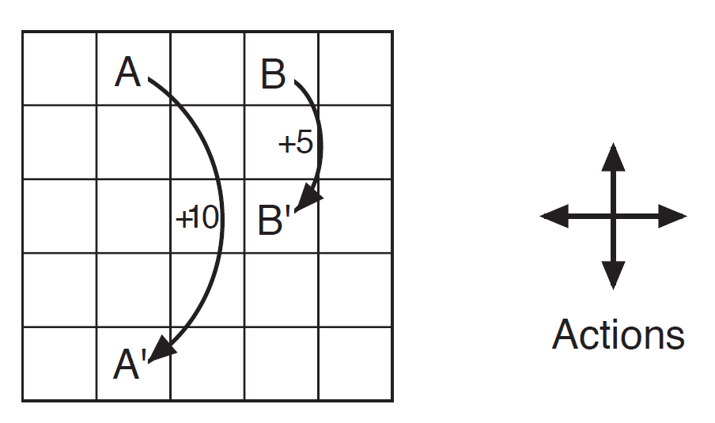
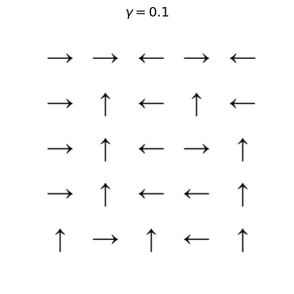
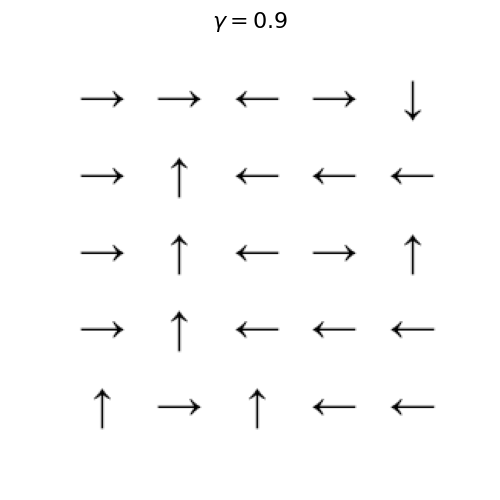

# Reinforcement learning

## Markov Decision Process: Gridworld

The cells of the grid correspond to the states of the environment. At each cell, four actions are possible: up, down, left, and right, which deterministically cause the agent to move one cell in the respective direction on the grid. Actions that would take the agent off the grid leave its location unchanged, but also result in a reward of 􀀀1. Other actions result in  reward of 0, except those that move the agent out of the special states A and B. From state A, all four actions yield a reward of +10 and take the agent to A'. From state B, all actions yield a reward of +5 and take the agent to B'.

Two solutions are presented in the `mdp.ipynb` notebook:
- Generalized policy iteration
- Value iteration

Optimal policies for varying values of the discounting factor $\gamma$ are shown in the following images. Notably, the more farsighted agent desings a policy such that ends up in state A, which gives the highest reward, from any state it starts in. The myopic agent does not do that, as for some states close to B, it ends in B, with a suboptimal reward compared to A.

